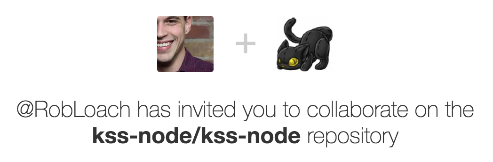

class: center, middle
# Le guide de styles

Concevoir son style en commençant par la doc.

Une charte graphique en conditions réelles.

---

## Pourquoi ce sujet ?

Je suis __Yvain Liechti__,  “**Lead Front End Developer**”  
et consultant chez __Clever Age__ depuis près de 5 ans.


???

- découvert le web jeune
- responsable des outils des intégrateurs

---

### Et depuis peu…

… collaborateur sur le projet __kss-node__.



???

- la semaine dernière
- Rob Loach un des contributeurs de KSS

---

## La charte graphique

Ce sont toutes les règles imposées par le __directeur artistique__
afin que toutes créations respectent l’__identité visuelle__.

Le guide de styles en est l’extension technique.

- transcription de la charte graphique en code
- support de communication entre graphistes et développeurs

???

- Un directeur artistique est par définition le créateur d’une charte graphique
- Sinon c’est un graphiste

### Quelques guides de styles connus

- [Bootstrap](https://getbootstrap.com/docs/4.0)
- [Lonelyplanet](http://rizzo.lonelyplanet.com/styleguide)
- et [d’autres](https://adele.uxpin.com/)

---

## Écrire de la doc, c’est long.

Oui, mais __en automatisant c’est plus facile__ et « il y a une app pour ça ».

Ou plutôt des outils :
- react-styleguidist, pour les adeptes de React,
- vue-styleguidist, un fork pour Vue.js un peu en retard,
- mdcss,
- styledocco,
- Paternlab.io,
- KSS,
- …

Si la documentation n’est pas mise à jour en même temps que le code,
elle diverge et perd son utilité.

Pour éviter ça, ces outils permettent de __garder la doc proche du code__ correspondant.

???

mdcss et styledocco ne sont plus vraiment maintenus et pêchent un peu niveau communauté.

Patern Lab : bonne approche présentée comme outil dédié à la méthode Atomic Design.

À l’époque en php, depuis une version node à pris le dessus.

Il y en a d’autres.

N’hésitez pas à me twitter des liens si vous en connaissez.

---

## KSS ou plutôt kss-node

Les avantages :
- Indépendant du système de génération du CSS (pré et post-processeurs)
- Gère differents langages de template (twig.js, handlebars, nunjucks)
- Permet de faire son propre `builder` (surcharger, ajouter des fonctionalités et styler son guide de style).

???

J’attends les premiers qui vont me sortir le guide de styles de leur guide de styles

---

### Commencer par la doc

```css
/*
Buttons

Simple buttons.

Markup:
<button type="button" class="btn">Button</button>
<a href="#" class="btn">Button link</a>

Style guide: UI.Buttons
*/
```

--

```css
.btn {
  display: inline-block;
  padding: .5em 1.5em;
  border-radius: 20em; /* excessive value to keep it round */
  font-weight: bold;
  background-color: #E87F67;
  color: #3E3040;
  /* … */
}
```

???
- titre qui va apparaitre dans la doc KSS
- description en markdown


---

### Lister les classes modificatrices
```scss
/*
Alerts

Box to communicate with users

.alert_info     - info message
.alert_success  - success message
.alert_warning  - warning message
.alert_error    - error message

Markup:
<div class="alert {{ modifier_class }}">
  <p>Alerts message with a <a href="#">link</a>.</p>
</div>

Style guide: Elements.Alerts
*/
```

???

notez le `{{ modifier_class }}`

---

### Handlebars, Twig.js ou Nunjucks
```scss
/*
List

Default style for ordered and unordered lists.

Markup:

  <{{ element }}>
    
      <li>Item {{ i }}</li>
    
    <li> An other item but with more text to show you how the list element will look like it a sentence need to go to a new line.</li>
    <li>
      <p>Wath if some paragraphs are in the list?</p>
    </li>
    <li>
      <{{ element }}>
        
          <li>Item {{ i }}</li>
        
          <li>
            <{{ element }}>
              
                <li>Item {{ i }}</li>
              
            </{{ element }}>
          </li>
      </{{ element }}>
    </li>
  </{{ element }}>


Style guide: Bases.Lists
*/
```

???

Faire des boucles, des conditions, …
Mais là on va dire :
- écrire du code dans un commentaire, c’est quand même bien naze
- pas de coloration syntaxique
- je ne peux pas bénéficier de la puissance de mon éditeur (perso j’utilise VScode)

---

### Un template externe
```scss
/*
Social Card

Card with name and social media link of user.

Markup: _socialCard.twig

Style guide: Elements.SocialCard
*/
```

---

### Que l’on peut accompagner de données
```json
{
  "firstName": "Yvain",
  "lastName": "Liechti",
  "twitterName": "ryuran78",
  "githubName": "ryuran",
  "img": "../assets/svg/cat.svg",
  "site": {
    "url": "https://ryuran.info",
    "name": "Ryuran.info"
  }
}
```

```twig
<div class="socialCard">
  <div class="socialCard-figure"></div>
  <h1 class="socialCard-title">
    <span class="socialCard-firstName">{{ firstName }}</span>
    <span class="socialCard-lastName">{{ lastName }}</span>
  </h1>
  <div class="socialCard-desc">
    <p>
      À vos services sur twitter <a href="https://twitter.com/{{ twitterName }}"> @{{ twitterName }}</a><br/>
      et sur Github <a href="https://github.com/{{ githubName }}"> @{{ githubName }}</a>.
    </p>
    
      <p><a href="{{ site.url }}">{{ site.name }}</a></p>
    
  </div>
</div>
```
---

## Agrémenter KSS

Nous avons vu les fonctionalités natives de KSS.

Quand est-il si on veut documenter :
 - une palette de couleur ?
 - des symboles SVG ?
 - autre ?

Kss permet :
 - d’ajouter des propriétés,
 - de faire son propre builder,
 - de modifier templates et assets du builder.

???

Les propriétés custom s’utilises comme Markup

Un builder custom est une classe javascript qui etend un des builde natif

template, js, css

---

### Et c’est ce que nous avons fait,

tout d’abords pour nôtre boîte à outils d’intégrateurs web, le *Garden Starter Kit*,

puis chez mon actuel client __20 Minites__ pour sa charte graphique nommée __Colette__.

http://developers.20minutes.fr/colette/

---

## Les fonctionnalités future

KSS gèrera :
- les `builders` externes en tant que dépendance node,
- les modifier par attributs pour les état comme `[aria-busy=true]`,
- les liens par référence de section `[Buttons](kss:Elements.Buttons)`.

Et pour ça, on a besoin de vous, utilisateurs et pourquoi pas contributeurs.

---
class: center, middle

# Merci à tous !

C’est le moment des questions.

<div class="socialCard">
  <div class="socialCard-figure"></div>
  <h1 class="socialCard-title">
    <span class="socialCard-title-firstName">Yvain</span>
    <span class="socialCard-title-lastName">Liechti</span>
  </h1>
  <div class="socialCard-desc">
    <p>
      À vos services sur twitter <a href="https://twitter.com/ryuran78">@ryuran78</a><br>
      et sur Github <a href="https://github.com/ryuran">@ryuran</a>.
    </p>
    <p><a href="https://ryuran.info">Ryuran.info</a></p>
  </div>
</div>

Ces slides son disponible sur http://ryuran.info/conf-kss  
et toutes les sources sur https://github.com/ryuran.
